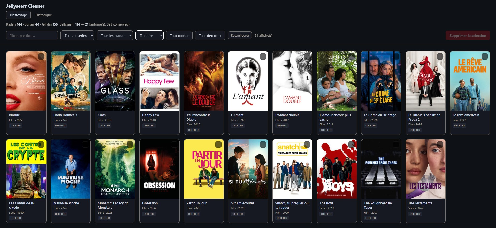
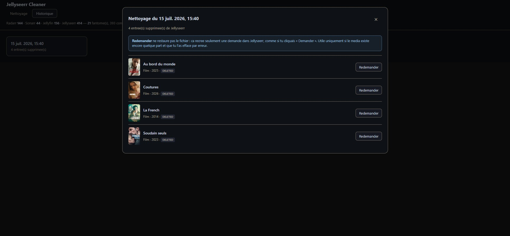

# Seerr Cleaner

[Français](README.md) · **English**

Local web interface to clean up **ghost media** entries in Seerr.

> **Compatibility** — Built for [Seerr](https://docs.seerr.dev/), the unified successor to Overseerr and Jellyseerr. Also works with existing **Jellyseerr** instances: the `/api/v1` endpoints are identical. Requires a **Jellyfin** library — Plex-backed instances are not supported.
>
> The interface and documentation are in French. Everything else (URLs, API keys, posters) is language-agnostic.

## The problem

When you delete a movie or a show in Radarr/Sonarr, **Seerr keeps the entry in its database**. The title still shows up as "Requested" or "Available" in the UI, even though the file is gone.

It's not breaking anything — people can still re-request the content — but after a few months of cleanup your library ends up full of dead entries.

Seerr does have a "Clear Media Data" button on each media page, but you have to click it **one by one**. With hundreds of entries, that's not realistic.

## The solution

This script compares your Seerr database against Radarr, Sonarr and Jellyfin, finds the orphaned entries, and shows them in a local web interface with posters. You tick, you delete.



*The History tab, to review past cleanups:*



## Installation

```bash
git clone https://github.com/karkarofff/seerr-cleaner.git
cd seerr-cleaner
pip install requests
python seerr_cleaner.py
```

**No configuration needed in the code.** On first launch, a setup page opens in your browser: paste your URLs and API keys, test each connection, and save. Everything is stored in a local `config.json` next to the script. On later launches, the scan starts straight away.

Where to find the API keys:

| Application | Path |
|---|---|
| Seerr | Settings → General → API Key |
| Radarr / Sonarr | Settings → General → API Key |
| Jellyfin | Dashboard → Advanced → API Keys → `+` |

URLs must have **no trailing slash**. If your apps sit behind a reverse proxy with a subpath (`https://server.com/radarr`), include the subpath.

## Terminal / cron mode

Scan without a browser (never deletes anything):

```bash
python seerr_cleaner.py --scan-only          # readable report
python seerr_cleaner.py --scan-only --json   # JSON output
```

Exit codes: `0` = no ghosts, `1` = ghosts found, `2` = error.
Handy in a cron job to get alerted when ghosts appear — deletion always stays a manual decision in the UI.

## Docker

```bash
docker build -t seerr-cleaner .
docker run -d --name seerr-cleaner -p 8765:8765 -v ./data:/data seerr-cleaner
```

UI at `http://server-ip:8765` — configuration and backups are persisted in `./data`.

## How a ghost is identified

A media entry is flagged **only** if it is:

- missing from **every** declared Radarr/Sonarr instance, **AND**
- missing from **Jellyfin**

The double check matters: Seerr marks as available anything present in Jellyfin, including content imported manually that never went through Radarr/Sonarr. Comparing against the *arrs alone would wrongly flag it as a ghost.

Entries with status `PENDING` (awaiting approval), `UNKNOWN` and `BLACKLISTED` are always skipped.

## 4K instances — read this

If you run **separate Radarr/Sonarr instances for 4K**, declare all of them: the setup page lets you add as many Radarr and Sonarr instances as needed.

If you forget one, **everything that only exists in that instance will be seen as a ghost** and offered for deletion. That's the one real way to shoot yourself in the foot with this tool.

A warning is shown in the interface if more than 40% of your database is flagged — usually the sign that an instance is missing from the config.

## Safety

This is a tool that deletes things, so let's be explicit about what it does:

- **Everything runs locally.** The server only listens on `127.0.0.1`. Your API keys never leave your machine: they live in `config.json`, on your disk.
- **Radarr, Sonarr and Jellyfin are never modified.** The script only issues `GET` requests against them. Their delete endpoints aren't even implemented in the code.
- **No video file is ever deleted.** The script has no access to your server's filesystem.
- The only destructive call is `DELETE /api/v1/media/{id}` on Seerr — exactly what the "Clear Media Data" button does.
- **A JSON backup is written before every deletion** (`backups/` folder), with Seerr IDs, TMDB/TVDB IDs, titles and statuses.
- The scan **aborts** if any source returns an empty library. Without that guard, a Radarr that happens to be offline would make your entire library look like ghosts.

Realistic worst case: you lose the request history of a media entry in Seerr. Never the file.

> ⚠ `config.json` holds your API keys in plain text. It's listed in the bundled `.gitignore` — never commit it.

## Usage

The browser opens on `http://127.0.0.1:8765`. The scan takes anywhere from a few seconds to a couple of minutes depending on library size.

Then:

- Click a poster to select it (it turns red)
- Filter by title, by type (movie/show) or by **status**
- Sort by title, status, year or type
- "Tout cocher" (select all) only ticks what is **currently visible after filtering**
- "Reconfigurer" takes you back to the setup page

### History

A "Historique" tab lists all your past cleanups (each deletion writes a backup). Click one to see the deleted media in detail, with posters and statuses.

Each entry has a "Redemander" (re-request) button that creates a new request in Seerr via the API (`POST /api/v1/request`). **This does not restore the video file**: it behaves as if you clicked "Request" in Seerr. It's only useful if the media still exists somewhere and you removed the entry by mistake — for a genuine ghost, re-requesting would just trigger a fresh download.

Statuses are colour-coded:

| Status | Meaning |
|---|---|
| `DELETED` | Seerr already knows the media was removed. Safest to clean. |
| `PROCESSING` | Seerr thinks a download is in progress. Check before deleting. |
| `AVAILABLE` | Seerr thinks it's available. Verify in Jellyfin before deleting. |

**Recommended approach**: filter on `DELETED`, select all, delete. That clears the bulk with no risk. Handle the rest case by case.

## Edge cases

**A media shows as `AVAILABLE` and is flagged as a ghost, but it does exist in Jellyfin.** It most likely has no TMDB/TVDB provider ID in Jellyfin (mis-identified metadata), so the script can't match it. Fix the metadata in Jellyfin (Identify → TMDB search) rather than deleting the entry.

**Title shown as "fiche TMDB introuvable" (TMDB record not found).** The record was deleted or merged on TMDB's side. The Seerr entry is an empty shell — safe to clean.

## Not supported

- **Plex.** Seerr supports Plex, Jellyfin and Emby, but this script checks the library through the Jellyfin API. A Plex-backed Seerr instance would need that part rewritten. Contributions welcome.
- Season-level cleanup. If a show still exists in Sonarr, it is kept entirely, even if you deleted individual seasons.

## Licence

MIT. Provided with no warranty. Check what you delete.
